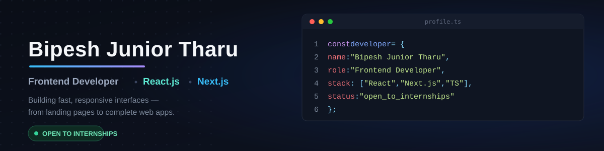

  

<h1 align="center">Hi, I'm Bipesh Junior 👋</h1>

  <strong>Frontend Developer | React | JavaScript | TypeScript | MERN</strong>

  I build responsive web applications with React and modern JavaScript, with hands-on experience developing full-stack applications using the MERN stack.

  
  
  

---

## About Me

I'm a frontend developer focused on building **responsive, accessible, and practical web applications**.

My primary focus is **React and modern JavaScript**, with experience building full-stack applications using **Node.js, Express.js, MongoDB, and REST APIs**.

I enjoy turning ideas into functional products, learning through hands-on development, and continuously improving my frontend engineering skills.

---

## Featured Projects

### SewaPath

**Citizen-focused government service navigator for Nepal**

SewaPath is a full-stack MERN application designed to make government services easier to discover and navigate through a centralized, responsive platform.

The application combines service discovery, authentication, categorization, and location-based functionality to provide citizens with a simpler way to find relevant government services.

**Tech Stack**

`React` `JavaScript` `Tailwind CSS` `Node.js` `Express.js` `MongoDB` `Mongoose` `JWT` `Leaflet`

**Key Features**

* Responsive, mobile-first React interface
* Government service discovery and categorization
* RESTful backend built with Node.js and Express.js
* MongoDB data modeling with Mongoose
* JWT-based authentication
* Location-based features using Leaflet
* Frontend and backend integration
* Full-stack MERN architecture

  
  

---

### Agency.Ai

**Modern AI-focused digital agency interface**

Agency.Ai is a React-based frontend project focused on creating a modern, responsive digital agency experience through reusable components, structured layouts, and interactive motion.

The project demonstrates my ability to translate a visual concept into a responsive interface while maintaining reusable component structure and smooth user interactions.

**Tech Stack**

`React` `Tailwind CSS` `Framer Motion`

**Key Features**

* Component-based React architecture
* Reusable UI sections and components
* Responsive layouts across screen sizes
* Tailwind CSS utility-based styling
* Framer Motion animations and transitions
* Interactive interface elements
* Modern landing-page design

  
  

---

## Technical Skills

### Frontend

  

### Backend & Database

  

### Tools

  

---

## GitHub Activity

  
  

  

---

## Currently Focused On

* Building production-quality React applications
* Strengthening JavaScript and TypeScript fundamentals
* Improving frontend architecture, responsive UI, and accessibility

---

## Open to Opportunities

I'm currently open to:

* **Frontend Developer Internships**
* **React / Junior Frontend Developer Roles**
* **MERN / Full-Stack Internships**
* **Open-source opportunities**

I'm looking for opportunities where I can contribute to real products, collaborate with experienced developers, and continue growing through hands-on engineering.

  
  

---

  © Bipesh Junior Tharu

